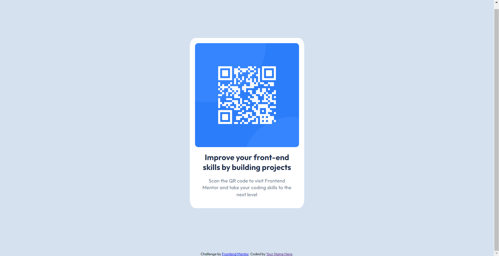

## Frontend Mentor - QR code component solution

### Screenshot

### Links

- Solution URL: [Add solution URL here](https://github.com/jen067/QR-code-component.git)
- Live Site URL: [Add live site URL here](https://jen067.github.io/QR-code-component/)

## My process

### Shortcomings in the First Version I Created

1. Strange Responsive Website: Overused media queries to adjust page size and card scaling.
2. Padding: Did not make good use of padding to create internal spacing within the cards.
3. Class Naming: The naming of classes was unclear and should include specific tags to enhance recognizability, such as "qr".
4. Relative Paths: Incorrect path settings appeared in the image links.

### Adjustments Made After Reviewing Other Students' Samples

1. Class Naming: Consistently used "qr" as a prefix for naming instead of simply using "container", "wrap", "content", etc. All containers should be clearly named based on their type, such as "title", "paragraph".
2. Effective Use of CSS Variables: Established variables in advance with :root to facilitate repeated use and easy reference in later style settings.
3. Padding: Made good use of padding to adjust internal spacing.
4. Text Style Settings:
   (a) Used line-height to increase the space between lines, making the text less cramped.
   (b) Used letter-spacing to create line breaks and increase spacing between characters.

### Built with

- Semantic HTML5 markup
- CSS custom properties
